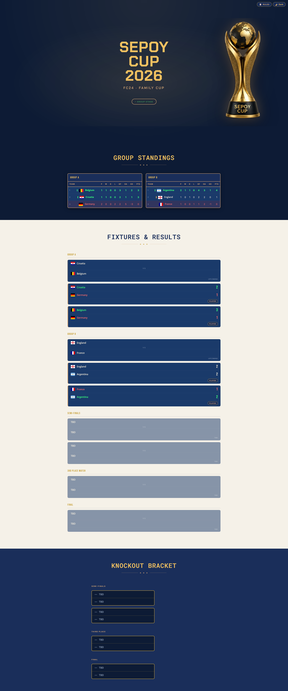
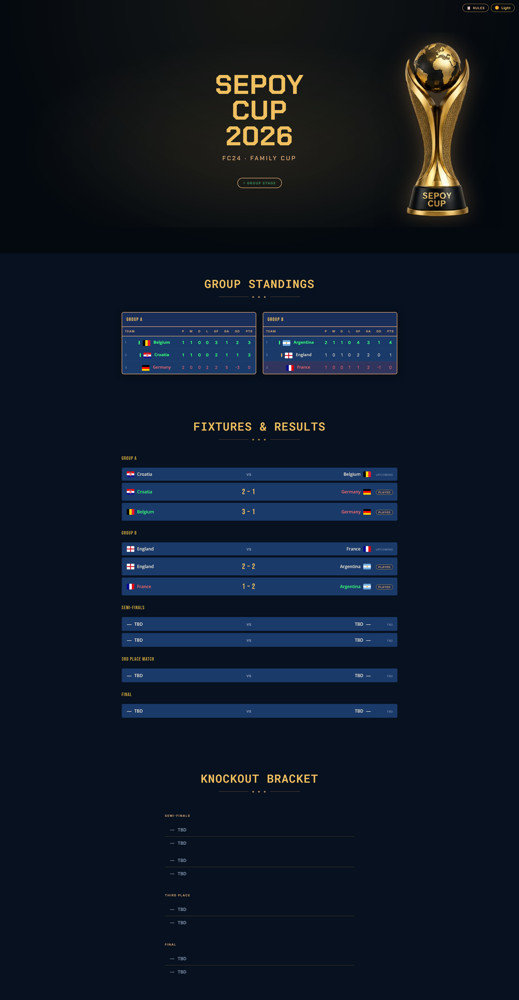
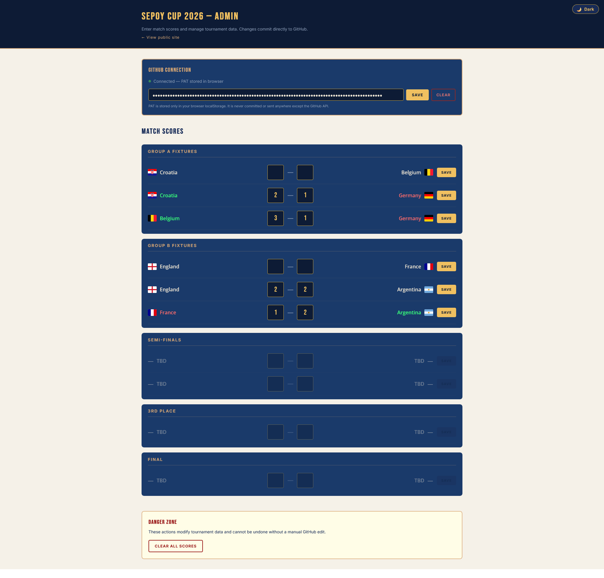
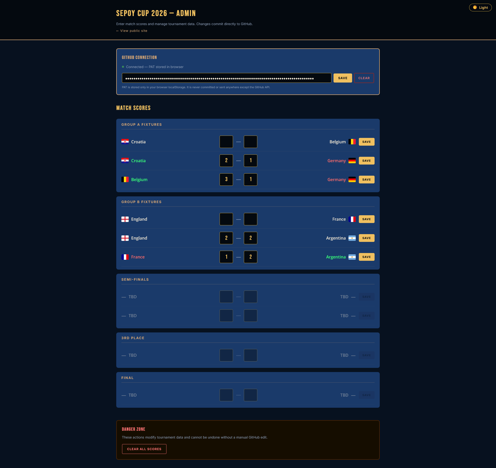

<div align="center">


# 🏆 Sepoy Cup 2026

**The family FC24 gaming tournament — coinciding with the FIFA World Cup 2026**

[](https://fsepoy.github.io/sepoy-cup-2026)
[](https://github.com/fsepoy/sepoy-cup-2026/actions)
[](https://vitest.dev)

*Edition I · FC24 · Family Cup*

</div>

---

## ✨ Features

| Feature | Description |
|---|---|
| 🏟️ **Group Standings** | Auto-calculated tables for Groups A & B — Pts → GD → GF → alphabetical |
| ⚽ **Fixtures & Results** | All matches displayed with live scores as they're entered |
| 🗂️ **Knockout Bracket** | Auto-seeded semi-finals from group standings, with animated reveal |
| 🥇 **Champion Section** | Confetti celebration + champion banner when the tournament ends |
| 📜 **Certificate Generator** | Download a printable PNG champion's certificate |
| 🔐 **Admin Panel** | Secure score entry via GitHub PAT — no backend needed |
| 🌙 **Light / Dark Theme** | Matches the tournament pack in light; elegant dark inversion with a click |
| 📱 **Fully Responsive** | Works on desktop, tablet, and mobile |
| ⚡ **Zero Backend** | Static site — data lives in a public GitHub JSON file |

---

## 📸 Screenshots

<div align="center">

### 🌟 Light Theme



### 🌙 Dark Theme



### 🔐 Admin Panel

| Light | Dark |
|---|---|
|  |  |

</div>

---

## 🏟️ Tournament

**Groups:**

| Group A 🔵 | Group B 🔴 |
|---|---|
| 🇭🇷 Croatia | 🏴󠁧󠁢󠁥󠁮󠁧󠁿 England |
| 🇧🇪 Belgium | 🇫🇷 France |
| 🇩🇪 Germany | 🇦🇷 Argentina |

**Format:** 6 group fixtures → 2 semi-finals → 3rd place play-off → Final

**Trophy:** 🏆 The Legacy Cup — Edition 04

---

## 🏗️ Architecture

```
┌─────────────────────────────────────┐     ┌──────────────────────────────────┐
│   fsepoy/sepoy-cup-2026             │     │   fsepoy/sepoy-cup-data          │
│   (this repo)                       │     │                                  │
│                                     │     │   2026/fc24/data.json            │
│   Vite app  ──────────── reads ──────────▶│   (teams, fixtures, scores)      │
│                                     │     │                                  │
│   Admin panel ──── writes via ──────────▶│   GitHub Contents API            │
│                    PAT              │     │   (PAT-gated, committed as JSON) │
│                                     │     └──────────────────────────────────┘
│   GitHub Actions → gh-pages branch  │
└─────────────────────────────────────┘
           │
           ▼
   https://fsepoy.github.io/sepoy-cup-2026
```

**Key decisions:**
- 🚫 No backend, no database, no server costs
- 📦 Data versioned in git (`2026/fc24/` → extensible for future years)
- 🔑 PAT stored in `localStorage` only — never in source code
- 🛡️ All JSON data sanitised with `escapeHtml()` before rendering

---

## 🛠️ Tech Stack

| Layer | Choice |
|---|---|
| ⚡ Build | [Vite 6](https://vitejs.dev) — vanilla JS, no framework |
| 🎬 Animations | [GSAP 3](https://gsap.com) — scroll triggers, trophy float, confetti |
| 🖼️ Certificate | [html2canvas](https://html2canvas.hertzen.com) — PNG export |
| 🎨 Styling | Custom CSS with design tokens (`--color-navy`, `--color-gold`, …) |
| 🧪 Testing | [Vitest](https://vitest.dev) — 20 unit tests |
| 🌐 Hosting | GitHub Pages (`gh-pages` branch) |
| 📡 Data API | GitHub Contents API (read raw · write via PAT) |

---

## 🚀 Getting Started

### Prerequisites

- Node.js 20+
- GitHub CLI (`gh`) authenticated as `fsepoy`
- A GitHub PAT with `repo` scope (for admin score entry)

### Install & Run

```bash
# Clone the repo
git clone https://github.com/fsepoy/sepoy-cup-2026.git
cd sepoy-cup-2026

# Install dependencies
npm install

# Start dev server
npm run dev
# → http://localhost:5173/sepoy-cup-2026/
```

### Available Commands

| Command | Action |
|---|---|
| `npm run dev` | Start local dev server |
| `npm run build` | Production build to `dist/` |
| `npm run test` | Run Vitest unit tests |
| `npm run preview` | Preview production build locally |

---

## 🔐 Admin Panel

The admin panel (`/admin.html`) is used to enter match scores. It is **not linked** from the public site.

1. Navigate to `https://fsepoy.github.io/sepoy-cup-2026/admin.html`
2. Enter your GitHub PAT in the PAT section and click **Save to Browser**
3. Enter home/away scores for any fixture
4. Click **Save Score** — the JSON is committed to `sepoy-cup-data` automatically

> ⚠️ The PAT is stored only in your browser's `localStorage`. It is never transmitted anywhere except the GitHub API `Authorization` header.

---

## 📁 Project Structure

```
sepoy-cup-2026/
├── 📄 index.html              Public tournament site
├── 📄 admin.html              Admin score entry (not linked publicly)
├── 📄 vite.config.js
├── 📁 public/assets/
│   └── 🏆 trophy-legacy.png  The Legacy Cup image
├── 📁 src/
│   ├── 📄 main.js             Public site entry point
│   ├── 📄 admin.js            Admin entry point
│   ├── 🎨 style.css           Design system tokens + theme variables
│   ├── 📁 components/
│   │   ├── hero.js            Trophy + title hero section
│   │   ├── groups.js          Group standings tables
│   │   ├── fixtures.js        Match cards + results
│   │   ├── bracket.js         Knockout bracket (SVG)
│   │   ├── champion.js        Champion reveal + confetti
│   │   ├── certificate.js     PNG certificate generator
│   │   ├── theme-toggle.js    🌙/☀️ floating toggle button
│   │   └── admin/             Admin panel components
│   └── 📁 lib/
│       ├── data.js            Fetch + validate tournament JSON
│       ├── standings.js       Group table calculation (pure)
│       ├── knockout.js        Bracket seeding + resolution
│       ├── github.js          GitHub Contents API wrapper
│       ├── theme.js           Theme init / toggle / storage
│       └── utils.js           escapeHtml() XSS guard
├── 📁 .github/workflows/
│   └── deploy.yml             Auto-deploy to GitHub Pages on push
├── 📄 CLAUDE.md               Project docs for Claude Code
├── 📄 branding.md             Design system reference
├── 📄 tournament-governance.md Tournament rules
└── 📄 handover.md             Living session handover doc
```

---

## 🎨 Design System

The app uses the official **Sepoy Cup 2026** tournament pack aesthetic:

```css
--color-navy:        #1a2e5a   /* Primary navy */
--color-gold:        #d4a574   /* Warm gold */
--color-gold-bright: #f0c060   /* Gold headings */
--color-cream:       #f5f1e8   /* Light background */
```

**Fonts:** [Bebas Neue](https://fonts.google.com/specimen/Bebas+Neue) (display) + [Inter](https://fonts.google.com/specimen/Inter) (body)

**Theme switching** is instant via CSS custom properties on `data-theme="light|dark"`.

---

## 🗂️ Data Repository

Match data lives in a separate public repo: [`fsepoy/sepoy-cup-data`](https://github.com/fsepoy/sepoy-cup-data)

```
sepoy-cup-data/
└── 2026/
    └── fc24/
        └── data.json    ← teams, groups, fixtures, scores, champion
```

This structure is intentionally extensible — `2027/`, `2027/fifa/`, etc. can be added without changing the app logic.

---

## 🧪 Tests

```bash
npm run test
```

20 unit tests covering:
- ✅ Standings calculation (W/D/L, GD, GF tiebreakers)
- ✅ Knockout seeding from group standings
- ✅ Data validation
- ✅ Bracket resolution from fixture data

---

## 🔒 Security

| Concern | Mitigation |
|---|---|
| PAT exposure | Never in source code — `localStorage` only, passed as parameter |
| XSS | `escapeHtml()` applied to all JSON data rendered via `innerHTML` |
| Admin access | Not linked from public site; PAT required to commit any changes |
| Supply chain | Pinned `package-lock.json`; minimal, well-known dependencies |

---

## 📡 Deployment

Pushes to `main` auto-deploy via GitHub Actions:

```
push to main → npm ci → vite build → peaceiris/actions-gh-pages → gh-pages branch
```

Live at: **https://fsepoy.github.io/sepoy-cup-2026**

---

<div align="center">

Made with ⚽ + ❤️ for the family · Sepoy Cup 2026 · Edition I

*May the best team win* 🏆

</div>
